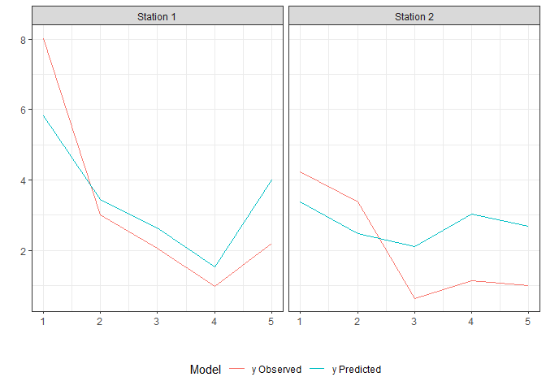

<!-- README.md is generated from README.Rmd. Please edit that file -->

# StempCens

The goal of `StempCens` is to estimate the parameters of spatio-temporal
models with censored or missing data using the SAEM algorithm (Delyon,
Lavielle, and Moulines 1999). This algorithm is a stochastic
approximation of the widely used EM algorithm and is particularly useful
for models in which the E-step does not have an analytical form. In
addition to providing the expressions used for parameter estimation in
the proposed model, the package includes the computation of the observed
information matrix using the method developed by Louis (1982). To
evaluate the performance of the fitted model, case-deletion diagnostics
are provided (see also Cook 1977; Zhu et al. 2001). Moreover, the
package computes the spatio-temporal covariance matrix and the effective
range for an isotropic spatial correlation function.

A detailed description of the model can be found in Valeriano et al.
(2021).

### Installation

You can install the released version of StempCens from
[CRAN](https://CRAN.R-project.org) with:

``` r
install.packages("StempCens")
```

### Functions

`StempCens` package provides five functions:

- `CovarianceM`: Computes the spatio-temporal covariance matrix for
  balanced data.
- `EffectiveRange`: Computes the effective range for an isotropic
  spatial correlation function.
- `EstStempCens`: Returns the maximum likelihood estimates of the
  unknown parameters.
- `PredStempCens`: Performs spatio-temporal prediction in a set of new
  spatial locations for fixed time points.
- `CrossStempCens`: Performs cross-validation, which measure the
  performance of the predictive model on new test dataset.
- `DiagStempCens`: Returns measures and graphics for diagnostic
  analysis.

### Example

This is a basic example which shows you how to solve a problem using
functions `EstStempCens` (parameter estimation) and `PredStempCens`
(prediction in new locations):

``` r
library(StempCens)
set.seed(403020)
# Initial parameter values
beta <- c(-1, 1.50)
phi  <- 5    
rho  <- 0.60
tau2 <- 0.80
sigma2 <- 2

# Simulating data
coord <- matrix(round(runif(100, 0, 10),9), ncol=2)
time  <- 1:5
x     <- cbind(rexp(250,2), rnorm(250,2,1))   # Covariates
data  <- rnStempCens(x, time, coord, beta, phi, rho, tau2,
                     sigma2, type.S="pow.exp", kappa=0.5,
                     cens="left", pcens=0.10)

# Splitting the dataset
train <- data[-c(211:220),]
test  <- data[211:220,]
sum(test$ci)
#> [1] 0

# Estimation
x   <- cbind(train$x1, train$x2)
est_train <- EstStempCens(train$yObs, x, train$ci, train$time, train[,1:2], train$lcl, train$ucl, 
                          init.phi=3.5, init.rho=0.5, init.tau2=1, kappa=0.5, type.S="pow.exp",
                          IMatrix=TRUE, M=20, perc=0.25, MaxIter=300, pc=0.20)
#> 
#> ---------------------------------------------------------------
#>      Spatio-temporal models for censored/missing responses     
#> ---------------------------------------------------------------
#>    Estimates     SE
#> β1   -1.1797 0.1877
#> β2    1.6018 0.0910
#> σ²    2.0035 1.4689
#> τ²    0.8095 0.4598
#> ϕ     4.0576 3.7428
#> ρ     0.6035 0.1143
#> The effective range is 36.414 spatial units.
#> --------------------------------------------------------------
#>  
#> 
#> Model selection criteria
#> ------------------------------------
#>             Value
#> Loglik.  -384.689
#> AIC       781.377
#> AICcorr.  781.738
#> BIC       802.261
#> ------------------------------------
#> 

# Prediction
xPre      <- cbind(test$x1, test$x2)
pre_teste <- PredStempCens(est_train, test[,1:2], test$time, xPre)

library(ggplot2)
Model   <- rep(c("y Observed","y Predicted"),each=10)
station <- rep(rep(c("Station 1", "Station 2"),each=5), times=2)
xcoord1 <- rep(seq(1:5),4)
ycoord1 <- c(test$yObs, pre_teste$predValues)
data2   <- data.frame(Model,station,xcoord1,ycoord1)
ggplot(data=data2, aes(x=xcoord1, y=ycoord1)) + geom_line(aes(color=Model)) + theme_bw() +
facet_wrap(station~.,nrow=1) + labs(x="",y="") + theme(legend.position="bottom")
```



For diagnostic analysis, the input parameter `IMatrix` needs to be
`TRUE` in the `EstStempCens` function.

``` r
diag <- DiagStempCens(est_train, type.diag="location", diag.plot = TRUE, ck=1)
```

### References

<div id="refs" class="references csl-bib-body hanging-indent">

<div id="ref-cook1977detection" class="csl-entry">

Cook, R-Dennis. 1977. “Detection of Influential Observation in Linear
Regression.” *Technometrics* 19 (1): 15–18.
<https://doi.org/10.1080/00401706.1977.10489493>.

</div>

<div id="ref-delyon1999convergence" class="csl-entry">

Delyon, Bernard, Marc Lavielle, and Eric Moulines. 1999. “Convergence of
a Stochastic Approximation Version of the EM Algorithm.” *Annals of
Statistics* 27 (1): 94–128. <https://doi.org/10.1214/aos/1018031103>.

</div>

<div id="ref-louis1982finding" class="csl-entry">

Louis, Thomas. 1982. “Finding the Observed Information Matrix When Using
the EM Algorithm.” *Journal of the Royal Statistical Society: Series B
(Methodological)* 44 (2): 226–33.
<https://doi.org/10.1111/j.2517-6161.1982.tb01203.x>.

</div>

<div id="ref-valeriano2021likelihood" class="csl-entry">

Valeriano, Katherine AL, Victor H Lachos, Marcos O Prates, and Larissa A
Matos. 2021. “Likelihood-Based Inference for Spatiotemporal Data with
Censored and Missing Responses.” *Environmetrics* 32 (3): e2663.
<https://doi.org/10.1002/env.2663>.

</div>

<div id="ref-zhu2001case" class="csl-entry">

Zhu, Hongtu, Sik-Yum Lee, Bo-Cheng Wei, and Julie Zhou. 2001.
“Case-Deletion Measures for Models with Incomplete Data.” *Biometrika*
88 (3): 727–37. <https://doi.org/10.1093/biomet/88.3.727>.

</div>

</div>
